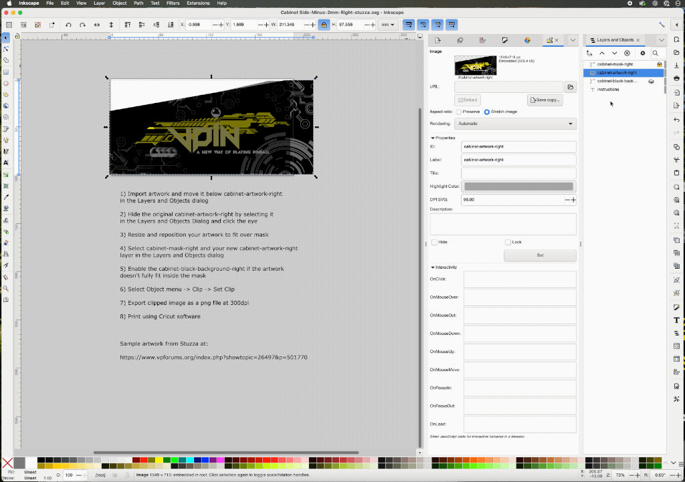

# Mini Visual Pinball Cab

A custom mini virtual pinball cabinet based on the excellent design by [@phoenixfox](https://makerworld.com/en/models/671966-2-screen-working-mini-virtual-pinball#profileId-599764).

 

## Software

### Batocera.linux 42 Beta
  - Multiple monitor support
  - External DMD support
  - Built in backglass theme
  - EmulationStation frontend
  - Visual Pinball Standalone 10.8.0
  - [Website](https://batocera.org/), [Beta](https://mirrors.o2switch.fr/batocera/x86_64/butterfly/last/)

## Hardware

### Mini PC
  - GMKtec Mini PC N97 G5
  - Intel 12th Gen Alder Lake N97 (up to 3.60GHz)
  - 12GB DDR5 RAM  
  - 256GB SSD
  - [Amazon](https://www.amazon.com/dp/B09Q8Z6VB7)

### Backglass
  - 3.5" LCD (LQ035NC111)
  - [AliExpress](https://www.aliexpress.us/item/3256807921740051.html)

### Playfield
  - 6" 2K LCD (LS060R1SX01)
  - [AliExpress](https://www.aliexpress.us/item/3256806044020274.html)

### Controls
  - XinMo XM-08 Joystick Encoder
  - [AliExpress](https://www.aliexpress.us/item/3256806433097325.html), [Site](http://www.xin-mo.com/single_player.html)

### Audio
  - PAM8406 5Wx2 Digital Amp
  - [Amazon](https://www.amazon.com/dp/B0BG2BWGMT)
  - 3W 8Ω Full-Range Mini Speakers
  - [Amazon](https://www.amazon.com/dp/B0BWYBFPW8)

### Decals
  - Glossy Printable Vinyl Sticker Paper
  - [Amazon](https://www.amazon.com/dp/B0CZQNGS4F)

## Modifications

### Backbox
  - Increased depth by **3mm** for amp + speaker clearance
  - Modified rear panel:
    - Speaker grill
    - Recessed speaker mounts
    - Screw holes for speaker installation

### Cabinet
  - Mounting support for XinMo USB encoder
  - Mounting holes for backbox brackets

## Cabinet Art

The cabinet artwork was based on **Stuzza 12's** original art used in **VPW's "Goonies Never Say Die"** table.  

Using **Inkscape**, a mask was created that overlaid a portion of the cabinet STL with the original artwork.  

Artwork was cut and applied using a **Cricut**, allowing for precise, clean decal placement on the cabinet.

I also printed some Visual Pinball swag, based on the logo svg [here](https://github.com/vpinball/vpinball/blob/master/docs/img/VisualPinball.svg).

## Credits

- Original design: [@phoenixfox](https://makerworld.com/en/models/671966-2-screen-working-mini-virtual-pinball#profileId-599764)

- Sample artwork: [@stuzza12](https://www.vpforums.org/index.php?showtopic=26497&p=501770)

