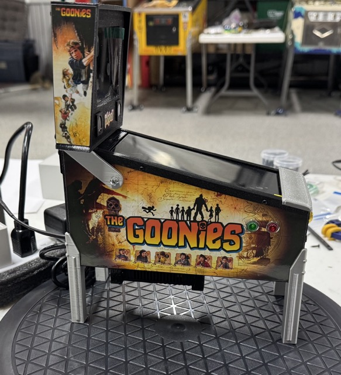
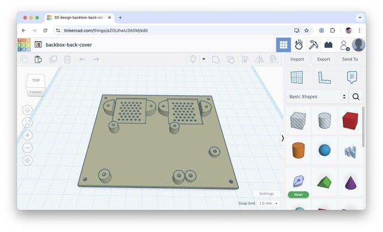
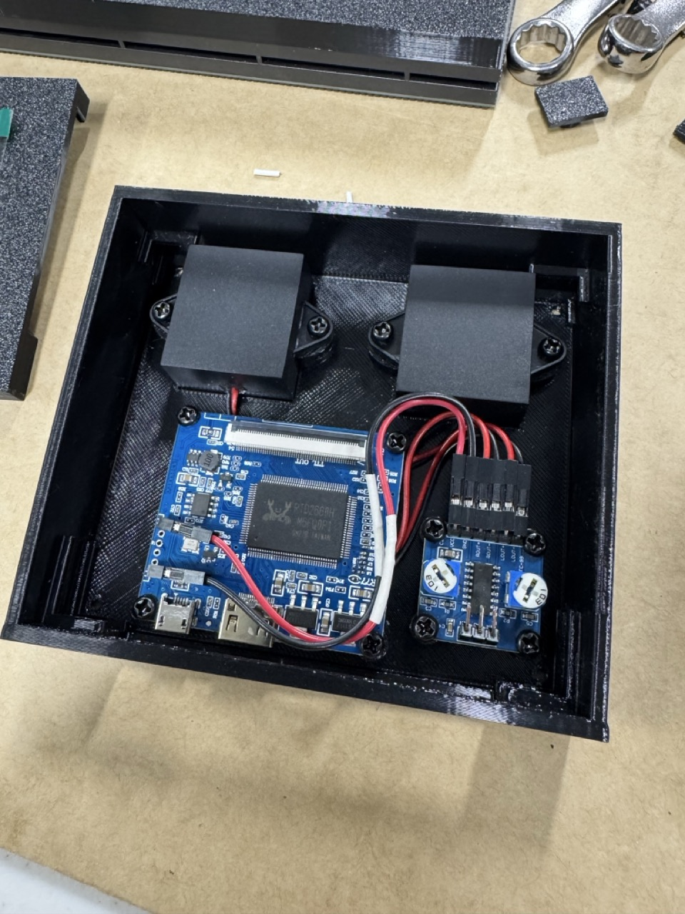
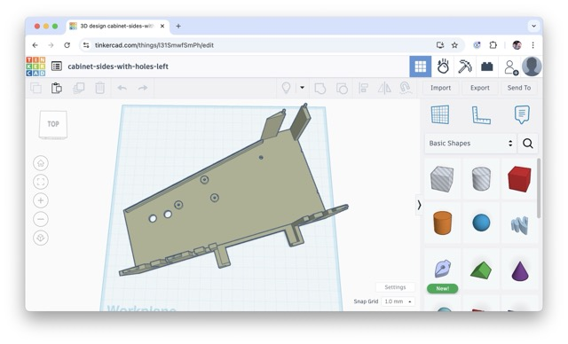
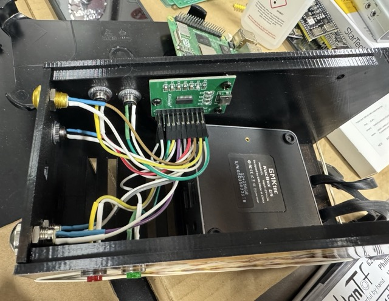
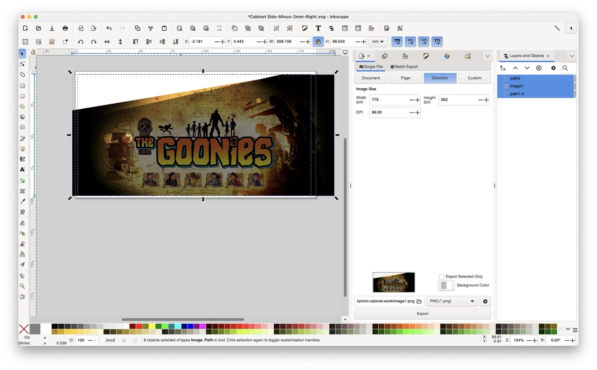
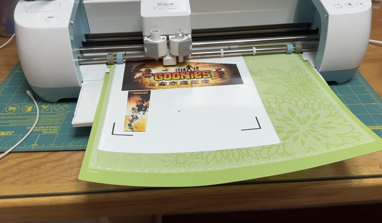
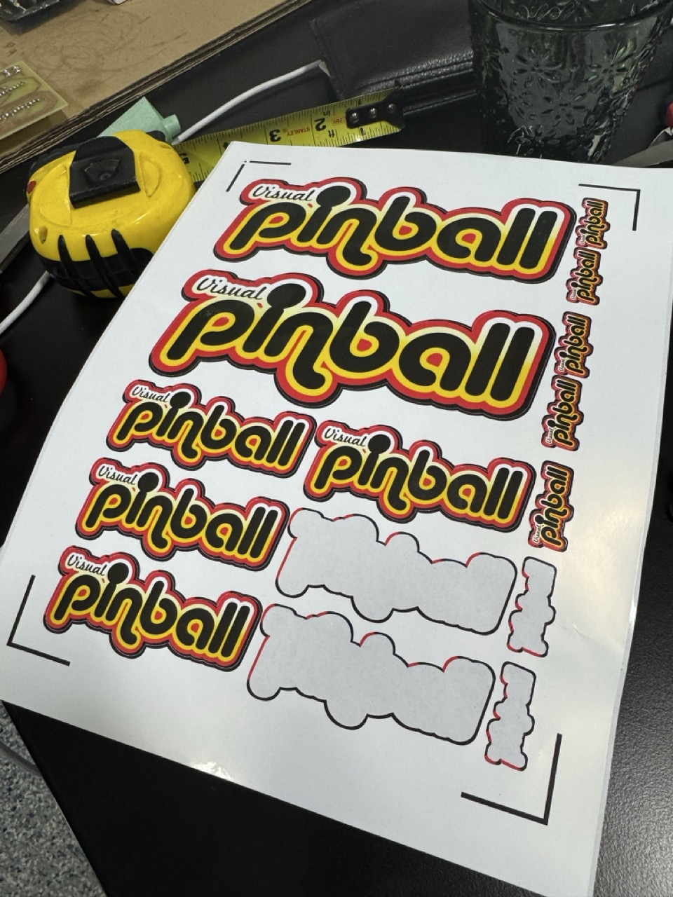

# Mini Visual Pinball Cab

A custom mini virtual pinball cabinet based on the excellent design by [@phoenixfox](https://makerworld.com/en/models/671966-2-screen-working-mini-virtual-pinball#profileId-599764).

 

---

## 🖥️ Software

- **OS**: Batocera.linux 42 Beta
- **Frontend**: Visual Pinball Standalone 10.8.0  
  - ✅ Multiple monitor support  
  - ✅ External DMD support  
  - ✅ Built in backglass theme

---

## 🧰 Hardware

### 💻 Mini PC

- **Model**: GMKtec Mini PC N97 G5  
- **Specs**:
  - Intel 12th Gen Alder Lake N97 (up to 3.60GHz)
  - 12GB DDR5 RAM  
  - 256GB SSD  
- [Amazon Link](https://www.amazon.com/dp/B09Q8Z6VB7)

### 🖼️ Displays

- **Backglass**: 3.5" LCD (LQ035NC111)  
  - [AliExpress Link](https://www.aliexpress.us/item/3256807921740051.html)

- **Playfield**: 6" 2K LCD (LS060R1SX01)  
  - [AliExpress Link](https://www.aliexpress.us/item/3256806044020274.html)

### 🎮 Controls

- **Joystick Encoder**: XinMo XM8 USB  
  - [AliExpress Link](https://www.aliexpress.us/item/3256806433097325.html)

### 🔊 Audio

- **Amplifier**: PAM8406 5Wx2 Digital Amp  
  - [Amazon Link](https://www.amazon.com/dp/B0BG2BWGMT)

- **Speakers**: 3W 8Ω Full-Range Mini Speaker  
  - [Amazon Link](https://www.amazon.com/dp/B0BWYBFPW8)

---

## 🛠️ Modifications

- **Backbox**:
  - Increased height by **3mm** for amp + speaker clearance
  - Modified rear panel:
    - Speaker grill
    - Recessed speaker mounts
    - Screw holes for speaker installation

- **Cabinet**:
  - Mounting support for XinMo USB encoder
  - Mounting holes for backbox brackets

---

## 🎨 Cabinet Artwork

The cabinet artwork was based on **Stuzza 12's** original art used in **VPW's "Goonies Never Say Die"** table.  

Using **Inkscape**, a mask was created that overlaid a portion of the cabinet STL with the original artwork.  

The final design was printed on **Glossy Printable Vinyl Sticker Paper**:  
[Amazon Link](https://www.amazon.com/dp/B0CZQNGS4F)

Artwork was cut and applied using a **Cricut**, allowing for precise, clean decal placement on the cabinet.

I also printed some Visual Pinball swag, based on the logo svg [here](https://github.com/vpinball/vpinball/blob/master/docs/img/VisualPinball.svg).

## 📸 Credits

- Original design: [@phoenixfox](https://makerworld.com/en/models/671966-2-screen-working-mini-virtual-pinball#profileId-599764)
